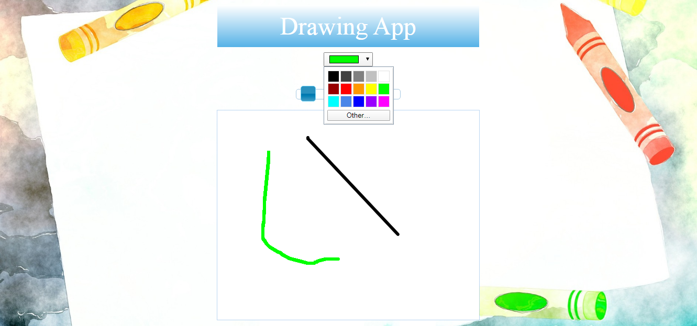

# JQuery_Darwing_App
Web drawing app using HTML Canvas, jQuery and jQueryUI. Very interactive and good for kids learning to draw.

## Built With

- HTML5 CANVAS
- CSS3
- JQUERY
- JQUERYUI

## Live Demo

[Live Demo](https://drawing-app.netlify.com/)

👤 **Author**
Ngodi albert
- Github: [@ngodi](https://github.com/ngodi)
- Twitter: [@albertngodi](https://twitter.com/albertngodi)
- Linkedin: [linkedin](https://www.linkedin.com/in/albertngodi/)

## 🤝 Contributing

Contributions, issues and feature requests are welcome!

Feel free to check the [issues page](issues/).

## Show your support

Give a ⭐️ if you like this project!

## 📝 License

This project is [MIT](lic.url) licensed.

